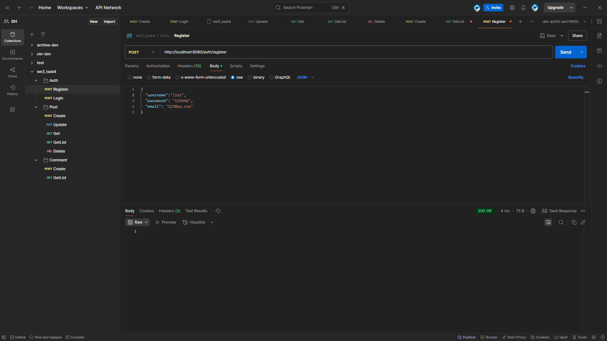
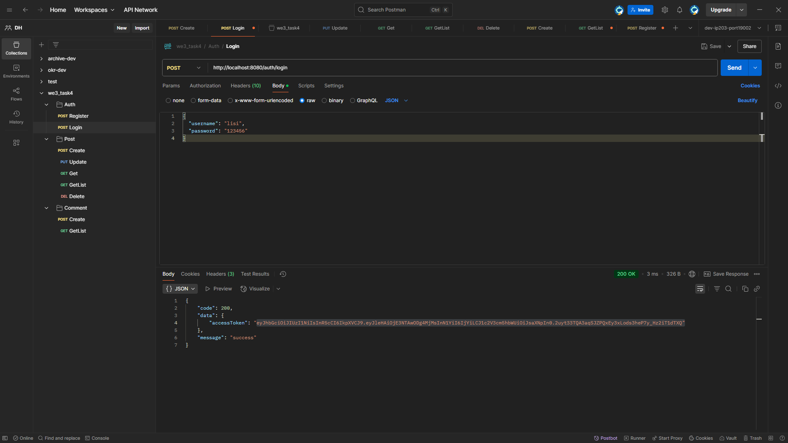
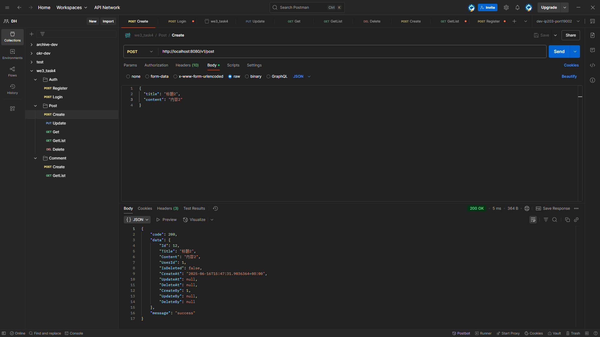
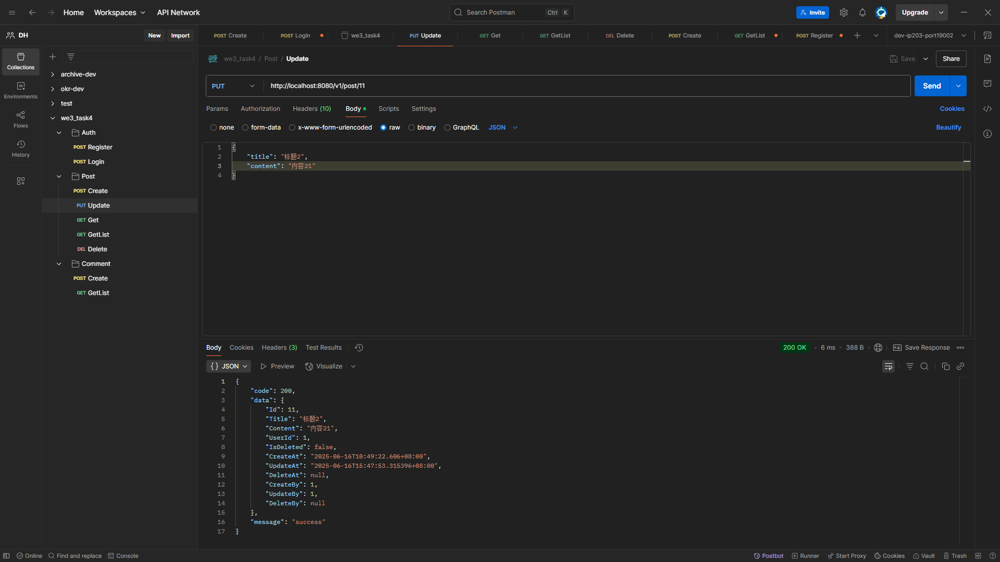
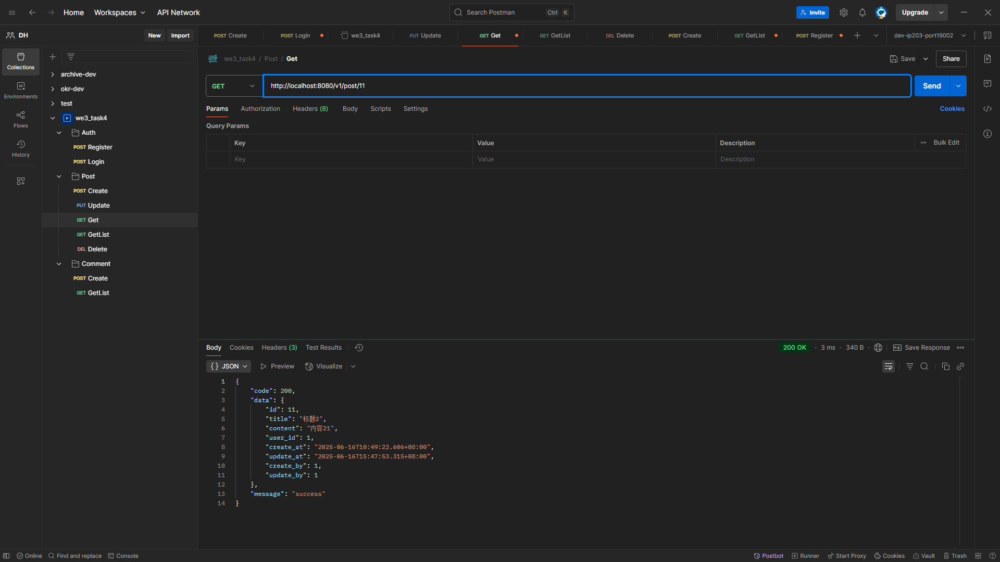
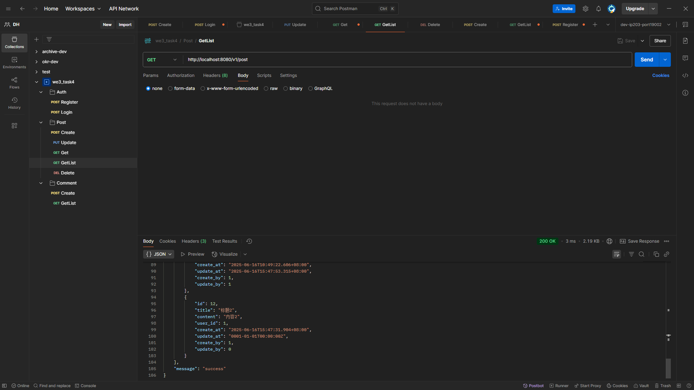
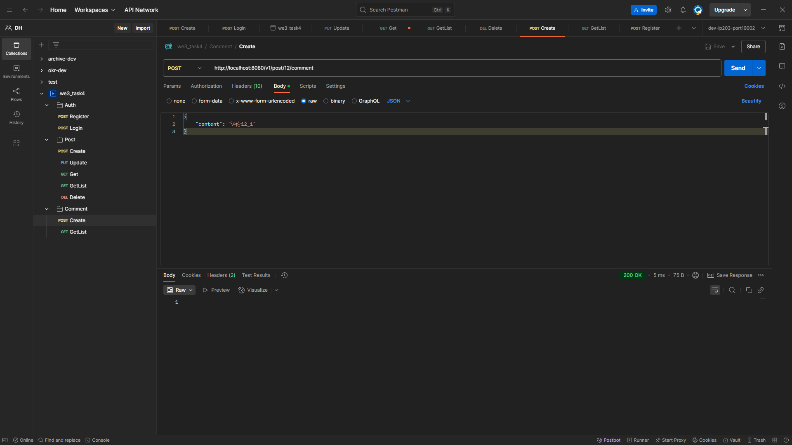
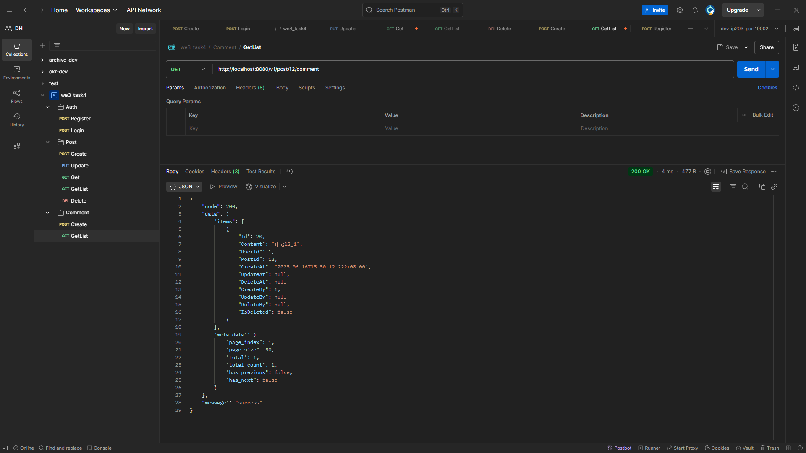

### 1. 配置文件

没有配置文件，写死在代码里。

### 2. 运行环境

win10 x64

### 3. 依赖安装步骤

Gin 框架安装

```cmd
go get -u github.com/gin-gonic/gin
```

Gorm 和 MySQL 驱动安装

```cmd
go get -u gorm.io/gorm
go get -u gorm.io/driver/mysql
```

热重载安装

```cmd
go get github.com/gravityblast/fresh
```

jinzhu/copier 自动映射安装

```cmd
go get -u github.com/jinzhu/copier
```

Zap 日志安装

```cmd
go get -u go.uber.org/zap
```

### 4. 启动方式

数据库准备

[create_database.sql](.\sql\create_database.sql)

```mysql
-- 创建数据库（如果不存在）
CREATE DATABASE IF NOT EXISTS `web3_task3` 
CHARACTER SET utf8mb4 
COLLATE utf8mb4_unicode_ci;
```

程序启动

```cmd
# 跳转到程序运行上下文目录
cd base1/task4
# 启动运行 方式一：自动热重载
fresh
# 启动运行 方式二：默认运行方式
go run main.go
```

程序启动时，会在 web3_task3 数据库中创建所需的数据表。

### 5.种子数据

程序运行后，填充演示数据

[data.sql](.\sql\data.sql)

```mysql
-- 用户表数据（5位用户，严格遵循密码生成规则）
INSERT INTO web3_task3.users (username, password, salt, email) VALUES
('张三', 'c38a0b185b590eaba5e7cc6e89d455d6', '615db57aa314529aaa0fbe95b3e95bd3', 'zhangsan@example.com'),
('李四', 'e04987b2a6b00c2876ef484690d7a80c', '36c942351ec9cc3ad124e288a5c9cf0b', 'lisi@163.com'),
('王五', '9913ae5a10d2800b74dc6e52c55d97a0', '3228f322c9c98a125554a24f875f0f7e', 'wangwu@qq.com'),
('赵六', 'd825625b51c4ee806b79048d7d5e6efd', 'b43536d0468a4ab0ccc538b975623cd9', 'zhaoliu@sina.com'),
('测试用户', 'c6270c0da0f4dd5ee90e36910f8d416e', '34d3b909b53dd70975f38d0d49a74ca6', 'test@test.com');
-- 预设所有用户原始密码为 123456（演示用）

-- 文章表数据（8篇文章）
INSERT INTO web3_task3.posts (title, content, user_id, create_at, update_at, is_deleted, create_by, update_by) VALUES
('区块链技术入门指南', '本文详细讲解区块链基础知识...', 1, '2023-05-10 09:30:00.000', '2023-05-10 09:30:00.000', 0, 1, 1),
('如何开发智能合约', 'Solidity开发实践教程...', 2, '2023-05-15 14:20:00.000', '2023-05-16 10:15:00.000', 0, 2, 2),
('Web3.0的未来发展趋势', '去中心化互联网的机遇与挑战...', 1, '2023-05-20 16:45:00.000', '2023-05-21 11:30:00.000', 0, 1, 1),
('数字货币投资心得', '我的加密货币投资经验分享...', 3, '2023-06-01 13:10:00.000', '2023-06-01 13:10:00.000', 0, 3, 3),
('DAO组织管理实践', '去中心化自治组织的运作模式...', 4, '2023-06-05 10:00:00.000', '2023-06-07 15:20:00.000', 0, 4, 4),
('NFT创作指南', '如何创作并发行自己的NFT作品...', 2, '2023-06-10 11:30:00.000', '2023-06-12 09:45:00.000', 0, 2, 2),
('元宇宙应用场景分析', '虚拟世界中的商业可能性...', 5, '2023-06-15 14:50:00.000', '2023-06-15 14:50:00.000', 0, 5, 5),
('DeFi协议安全审计要点', '去中心化金融项目的安全规范...', 3, '2023-06-20 17:30:00.000', '2023-06-22 16:10:00.000', 0, 3, 3);

-- 评论表数据（15条评论）
INSERT INTO web3_task3.comments (content, user_id, post_id, create_at, update_at, create_by, update_by, is_deleted) VALUES
('写得很好，对我帮助很大！', 2, 1, '2023-05-10 10:05:00.000', '2023-05-10 10:05:00.000', 2, 2, 0),
('有几个概念还是不太明白', 3, 1, '2023-05-10 11:20:00.000', '2023-05-10 11:20:00.000', 3, 3, 0),
('作者能推荐些学习资料吗？', 4, 2, '2023-05-15 15:30:00.000', '2023-05-15 15:30:00.000', 4, 4, 0),
('代码示例很实用，已收藏', 1, 2, '2023-05-16 09:10:00.000', '2023-05-16 09:10:00.000', 1, 1, 0),
('观点很有前瞻性！', 5, 3, '2023-05-21 08:45:00.000', '2023-05-21 08:45:00.000', 5, 5, 0),
('部分预测可能过于乐观', 2, 3, '2023-05-21 13:20:00.000', '2023-05-21 13:20:00.000', 2, 2, 0),
('感谢分享，避坑指南很有用', 4, 4, '2023-06-01 14:30:00.000', '2023-06-01 14:30:00.000', 4, 4, 0),
('最近市场行情不好啊', 1, 4, '2023-06-02 10:15:00.000', '2023-06-02 10:15:00.000', 1, 1, 0),
('我们公司正在实践DAO管理', 3, 5, '2023-06-06 11:40:00.000', '2023-06-06 11:40:00.000', 3, 3, 0),
('求更多案例分享', 5, 5, '2023-06-07 16:50:00.000', '2023-06-07 16:50:00.000', 5, 5, 0),
('NFT创作有版权问题吗？', 1, 6, '2023-06-11 09:20:00.000', '2023-06-11 09:20:00.000', 1, 1, 0),
('教程很详细，已成功铸造', 4, 6, '2023-06-12 10:30:00.000', '2023-06-12 10:30:00.000', 4, 4, 0),
('元宇宙教育应用很有前景', 2, 7, '2023-06-16 08:15:00.000', '2023-06-16 08:15:00.000', 2, 2, 0),
('安全审计确实很重要', 5, 8, '2023-06-21 09:45:00.000', '2023-06-21 09:45:00.000', 5, 5, 0),
('有没有推荐的审计工具？', 1, 8, '2023-06-22 17:50:00.000', '2023-06-22 17:50:00.000', 1, 1, 0);
```

### 5. 测试用例与结果

[Postman测试用例](.\test\postman.json)

测试结果

1. 用户注册

   

2. 用户登录

   

3. 文章新增

   

4. 文章更新

   

5. 获取文章明细

   

6. 获取文章列表

   

7. 删除文章（逻辑删除）

   

8. 添加评论

   

9. 获取文章评论列表

   